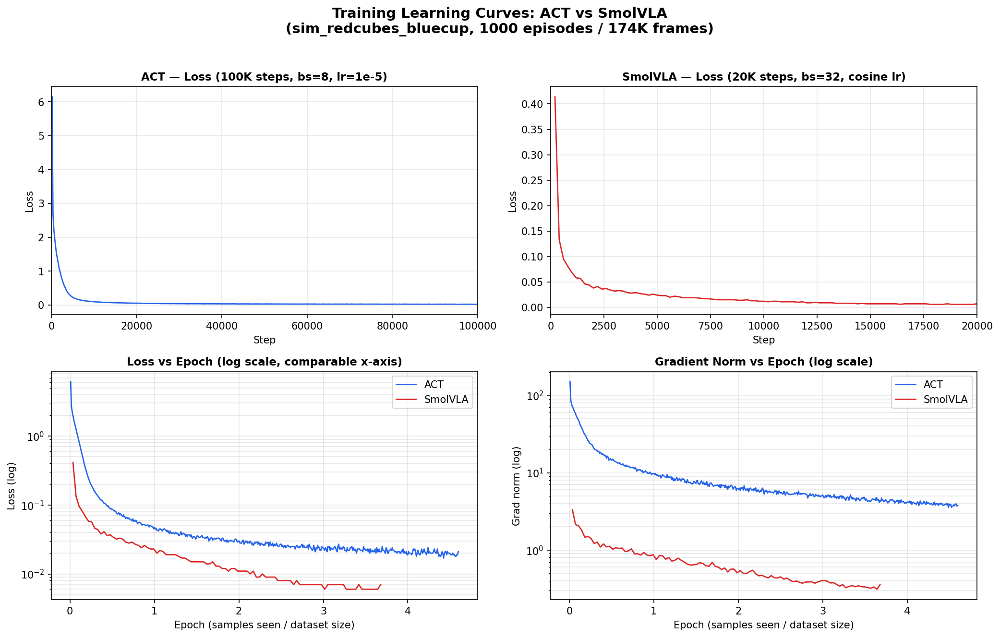
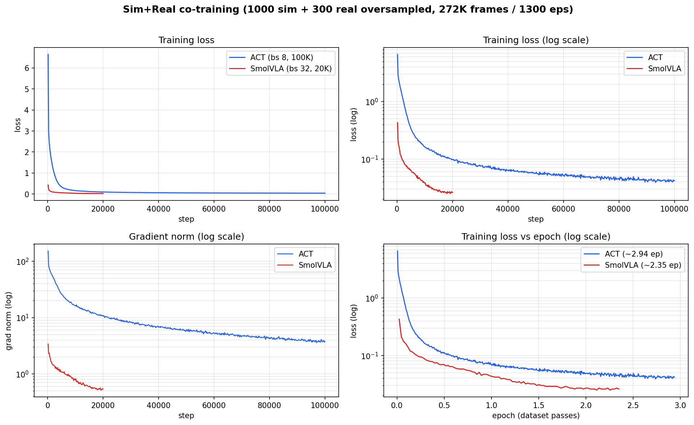

# sim2real-soarm-benchmark

The purpose of the project is to train a **bimodal pick-and-place** policy **entirely in MuJoCo simulation**, then deploy it
**zero-shot on the real SO-ARM101** and measure the success rate of the "Pick a cube and place it in a cup" task on the real hardware.


| Top camera (`front`) | Wrist camera |
|---|---|
|  |  |


The same task trained on the 100 real recorded episodes with Diffusion Policy and a fine-tuned SmolVLA (flow-matching) policy:
| Repo | Data source | Policy | Success rate | Mode balance `\|P(left)-0.5\|` |
|---|---|---|---|---|
| [`Diffusion policy`](https://github.com/yeeegem/multimodal-manipulation-benchmark) | real demos | Diffusion Policy | 63% | 0.50 (collapsed right) |
| [`SmolVLA (Flow matching)`](https://github.com/yeeegem/smolvla-soarm-benchmark) | real demos | SmolVLA | 60% | 0.50 (collapsed right) |
| **this repo** | **1000 episodes MuJoCo sim only** | LeRobot ACT | **0% (collapsed to the mean trajectory)** | **n/a (no successes)** |
| **this repo** | **1000 episodes MuJoCo sim only** | SmolVLA (fine-tuned) | **0% (0/5, grabbed nothing)** | **n/a (no successes)** |
| **this repo** | **1000 sim + 100 real, co-trained (real oversampled 3x)** | SmolVLA | **53% (16/30)** | **0.50 (collapsed right)** |

**Why ACT averages the trajectory:** ACT trains with an L1 reconstruction loss and runs deterministic
inference with its CVAE latent fixed to the prior mean (`z = 0`). With two identical cubes the
demonstrations are bimodal (reach left *or* right), and L1 regression with a fixed latent averages the
two modes instead of committing to one, so the policy drives down the middle path between the cubes and
grasps nothing. SmolVLA's flow-matching objective models the full multimodal action distribution, so it
samples one real mode instead of averaging.

All are evaluated on the real arm by the same success-rate measure. Mode balance is
`|P(left) - 0.5|` among successful trials: 0 is a perfect 50/50 split, 0.5 is full collapse to one
cube. Both real-data policies reached ~60% but collapsed to the right cube.

### Failure modes: real-only vs sim+real co-training

Operator-scored failure breakdown on the real arm (counts, with share of all trials in that run).
Trial counts differ between the two runs.

| Failure mode | SmolVLA, 100 real demos (20 trials) | SmolVLA, 1000 sim + 3x100 real (30 trials) |
|---|---|---|
| grabbed nothing | 7 (35%) | 4 (13%) |
| grasp slip | 0 | 9 (30%) |
| grasped wrong object | 1 (5%) | 0 |
| collision / unsafe | 0 | 1 (3%) |
| **total failures** | **8/20 (40%)** | **14/30 (47%)** |
| **success** | **12/20 (60%)** | **16/30 (53%)** |

Co-training cuts *grabbed nothing* from 35% to 13% (the arm reaches and closes on the cube far more
often), but the dominant failure shifts to *grasp slip* (0% to 30%): the sim demonstrations use a
weld-grasp abstraction and never teach robust frictional grasping, so the co-trained policy inherits
precise reaching but a less stable physical grip.

### If grasp slips counted as successes

A grasp slip means the arm reached, closed on, and lifted the *correct* cube but dropped it in
transport, so the perception and planning were right and only the physical grip failed. If those
near-misses are counted as successes, the picture is:

| Policy | Success (as scored) | Success (grasp slip counted as success) |
|---|---|---|
| SmolVLA, 100 real demos (20 trials) | 60% (12/20) | 60% (12/20) |
| SmolVLA, 1000 sim + 3x100 real (30 trials) | 53% (16/30) | **83% (25/30)** |

This is a hypothetical, not the scored result, but it localizes the remaining gap: for the co-trained
policy it is grasp *stability* (addressable with a better sim contact model or a handful of real grasp
demos), not sim-to-real transfer of reaching and object selection.

Train the sim policies with:

```bash
scripts/train_act.sh        # LeRobot ACT       -> runs/act_sim
scripts/train_smolvla.sh    # SmolVLA finetune  -> runs/smolvla_sim
```

Both policies train cleanly on the 1000-episode sim dataset (174K frames). ACT (100K steps,
bs=8) and SmolVLA (20K steps, bs=32, fine-tuned from `lerobot/smolvla_base`) both converge; on
the shared epoch axis SmolVLA reaches a lower action loss with a smaller gradient norm, as expected
from its pretraining.




## The task

Two identical 3 cm **red cubes** (left / right) and one **blue cup** on a gray-blue table with white
walls. The arm picks *either* cube and drops it in the cup, a genuinely **bimodal** problem. The
headline metric is the **mode-balance score** `|P(left) - 0.5|` among successful trials (0 = a perfect
50/50 split, 0.5 = collapse to one side), alongside success rate.

## The scene

White-printed SO-ARM101 on the near edge of a gray-blue table, boxed by white walls, with two red
cubes and a blue cup. Two cameras (a top "front" camera and a wrist camera on the community-standard
SO101 mount) give the exact `observation.images.front` / `observation.images.wrist` the policy uses
(shown at the top).

## The one hard requirement

The simulated dataset is **schema- and unit-identical** to the real dataset
[`yeeegem/redcubes_bluecup`](https://huggingface.co/datasets/yeeegem/redcubes_bluecup) so a policy
trained only on sim data runs on the real arm with no adaptation:

- features `observation.images.front` / `observation.images.wrist` (480x640x3 video @ 30 fps),
  `observation.state` (6), `action` (6); `robot_type: so_follower`;
- motor order `[shoulder_pan, shoulder_lift, elbow_flex, wrist_flex, wrist_roll, gripper]`;
- state/action are **absolute joint angles in degrees** (joints 1 to 5) and **gripper in
  `RANGE_0_100`**, matching LeRobot's calibrated convention (the units bridge in
  `sim2real_soarm/sim/kinematics.py`).

## Pipeline

1. **Robot asset**: official SO-ARM101 MJCF vendored from TheRobotStudio (`assets/so101/`).
2. **Units bridge**: convert between MuJoCo radians and LeRobot degrees / `RANGE_0_100` (`sim/kinematics.py`).
3. **Scene**: table, white walls, 2 red cubes, procedural wall-ring blue cup, front and wrist cameras (`sim/scene.py`).
4. **Scripted expert**: IK state machine, picks left/right 50/50 (`sim/expert.py`, `sim/ik.py`).
5. **Domain randomization**: lighting, colors, textures, object poses, wrist-camera pose, friction (`sim/randomization.py`).
6. **Record**: run the expert under DR into a LeRobotDataset (`data/record.py`).
7. **Train ACT**: `scripts/train_act.sh`.
8. **Deploy and score**: `python -m sim2real_soarm.soarm_eval.run` on the real arm.

## Quickstart

```bash
uv sync

# 1. Generate domain-randomized sim demos into a schema-identical LeRobot dataset
scripts/generate_demos.sh 500            # writes recordings/sim_redcubes_bluecup
uv run python scripts/replay_dataset.py --episode 0 --out episode0.gif   # sanity

# 2. Train ACT entirely on the sim data
scripts/train_act.sh                     # writes runs/act_sim/checkpoints/...

# 3. Deploy zero-shot on the REAL arm and score it (see "Running on the arm")

# tests (headless MuJoCo)
MUJOCO_GL=egl uv run --extra dev pytest tests/ -q
```

## Running on the arm

`soarm_eval/` is a human-in-the-loop evaluation harness: it drives the trained checkpoint on the
real SO-ARM101, and you score each trial success or failure. It logs an operator-scored
`results.csv` (success rate plus the left/right mode balance).

Robot port and camera device paths live in `configs/eval_real.yaml`. Edit `robot_port` and the
camera `path`s to match your setup. The language instruction is read automatically from the dataset
metadata, so it matches what the policy saw during training.

```bash
# ACT checkpoint
uv run python -m sim2real_soarm.soarm_eval.run \
    --checkpoint runs/act_sim/checkpoints/last/pretrained_model \
    --config configs/eval_real.yaml

# SmolVLA checkpoint (same command, the loader dispatches on the checkpoint config)
uv run python -m sim2real_soarm.soarm_eval.run \
    --checkpoint runs/smolvla_sim/checkpoints/last/pretrained_model \
    --config configs/eval_real.yaml
```

The `--checkpoint` is a `pretrained_model/` **directory**, not a `.pt` file. The harness homes the
arm, runs the episode (press Enter to end it, or it auto-stops after `eval.max_episode_steps`),
auto-returns the arm, then prompts you to score the trial. Each scored trial is appended to
`runs/<run>/eval/results.csv` immediately, so an interrupted run resumes where it left off. Pass
`--debug-frames` to dump the first trial's camera images to check camera identity, color, and
orientation against what the policy expects.

Aggregate a run's CSV into summary tables:

```bash
uv run python -m sim2real_soarm.soarm_eval.metrics runs/act_sim/eval/results.csv
```

This writes `metrics.json` and `tables.md` (success rate, mean success time, failure breakdown, and
the left/right mode-balance score) next to the CSV.

## Notes on the sim grasp

Reliable frictional grasping of a 3 cm cube with the SO-ARM101's long, bulky gripper is unstable in
sim, so the scripted expert uses a **weld grasp**: when the gripper closes on the target cube, the
cube is snapped onto the grasp point and welded to the gripper, then released on open. The
demonstrations stay visually correct for imitation learning (the cube tracks the gripper, the fingers
close), and the cube's free-body physics (resting on the table, dropping into the cup, tipping it)
are unchanged. See `sim2real_soarm/sim/scene.py` (`attach`/`detach`) and `sim/expert.py`.

Inspect or tune the scene with `scripts/view_scene.py` (render/orbit) and `scripts/tune_wrist.py`
(position the wrist camera and its mount). Camera and layout knobs live in `configs/scene.yaml`.
