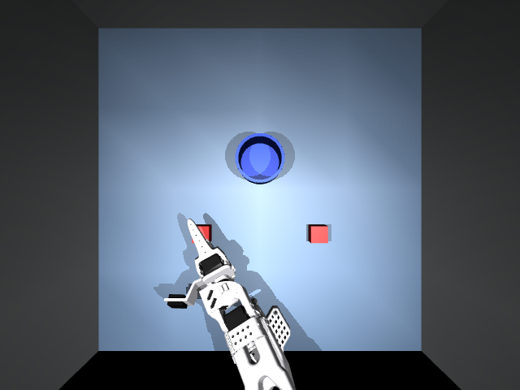
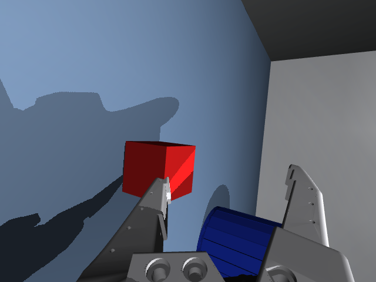

# sim2real-soarm-benchmark

Train a **bimodal pick-and-place** policy **entirely in MuJoCo simulation**, then deploy it
**zero-shot on the real SO-ARM101** and score it with the *same* operator-graded harness as the two
sibling real-data benchmarks, so the numbers drop straight into the same comparison table.

| Repo | Data source | Policy | Eval |
|---|---|---|---|
| [`multimodal-manipulation-benchmark`](https://github.com/yeeegem/multimodal-manipulation-benchmark) | real demos | Diffusion Policy | Tier-A operator |
| [`smolvla-soarm-benchmark`](https://github.com/yeeegem/smolvla-soarm-benchmark) | real demos | SmolVLA | `soarm_eval` Tier-A operator |
| **this repo** | **MuJoCo sim only** | LeRobot ACT (SmolVLA scaffolded) | `soarm_eval` Tier-A operator |

## The task

Two identical 3 cm **red cubes** (left / right) and one **blue cup** on a gray-blue table with white
walls. The arm picks *either* cube and drops it in the cup, a genuinely **bimodal** problem. The
headline metric is the **mode-balance score** `|P(left) - 0.5|` among successful trials (0 = a perfect
50/50 split, 0.5 = collapse to one side), alongside success rate.

## The scene

White-printed SO-ARM101 on the near edge of a gray-blue table, boxed by white walls, with two red
cubes and a blue cup. Two cameras (a top "front" camera and a wrist camera on the community-standard
SO101 mount) give the exact `observation.images.front` / `observation.images.wrist` the policy uses.
Render these yourself with `uv run python scripts/view_scene.py [--pose grasp]`.

| Top camera (`front`) | Wrist camera |
|---|---|
|  |  |

## The one hard requirement

The simulated dataset is **schema- and unit-identical** to the real dataset
[`yeeegem/redcubes_bluecup`](https://huggingface.co/datasets/yeeegem/redcubes_bluecup) so a policy
trained only on sim data runs on the real arm with no adaptation:

- features `observation.images.front` / `observation.images.wrist` (480x640x3 video @ 30 fps),
  `observation.state` (6), `action` (6); `robot_type: so_follower`;
- motor order `[shoulder_pan, shoulder_lift, elbow_flex, wrist_flex, wrist_roll, gripper]`;
- state/action are **absolute joint angles in degrees** (joints 1 to 5) and **gripper in
  `RANGE_0_100`**, matching LeRobot's calibrated convention (the units bridge in
  `sim2real_soarm/sim/kinematics.py`).

## Pipeline

1. **Robot asset**: official SO-ARM101 MJCF vendored from TheRobotStudio (`assets/so101/`).
2. **Units bridge**: convert between MuJoCo radians and LeRobot degrees / `RANGE_0_100` (`sim/kinematics.py`).
3. **Scene**: table, white walls, 2 red cubes, procedural wall-ring blue cup, front and wrist cameras (`sim/scene.py`).
4. **Scripted expert**: IK state machine, picks left/right 50/50 (`sim/expert.py`, `sim/ik.py`).
5. **Domain randomization**: lighting, colors, textures, poses, camera, friction (`sim/randomization.py`).
6. **Record**: run the expert under DR into a LeRobotDataset (`data/record.py`).
7. **Train ACT**: `scripts/train_act.sh`.
8. **Deploy and score**: `python -m sim2real_soarm.soarm_eval.run` on the real arm.

## Quickstart

```bash
uv sync

# 1. Generate domain-randomized sim demos into a schema-identical LeRobot dataset
scripts/generate_demos.sh 500            # writes recordings/sim_redcubes_bluecup
uv run python scripts/replay_dataset.py --episode 0 --out episode0.gif   # sanity

# 2. Train ACT entirely on the sim data
scripts/train_act.sh                     # writes runs/act_sim/checkpoints/...

# 3. Deploy zero-shot on the REAL arm and score it (same harness as the siblings)
uv run python -m sim2real_soarm.soarm_eval.run \
    --checkpoint runs/act_sim/checkpoints/last/pretrained_model --tier A
uv run python -m sim2real_soarm.soarm_eval.metrics runs/act_sim/eval/results.csv

# tests (headless MuJoCo)
MUJOCO_GL=egl uv run --extra dev pytest tests/ -q
```

## Notes on the sim grasp

Reliable frictional grasping of a 3 cm cube with the SO-ARM101's long, bulky gripper is unstable in
sim, so the scripted expert uses a **weld grasp**: when the gripper closes on the target cube, the
cube is snapped onto the grasp point and welded to the gripper, then released on open. The
demonstrations stay visually correct for imitation learning (the cube tracks the gripper, the fingers
close), and the cube's free-body physics (resting on the table, dropping into the cup, tipping it)
are unchanged. See `sim2real_soarm/sim/scene.py` (`attach`/`detach`) and `sim/expert.py`.

Inspect or tune the scene with `scripts/view_scene.py` (render/orbit) and `scripts/tune_wrist.py`
(position the wrist camera and its mount). Camera and layout knobs live in `configs/scene.yaml`.
